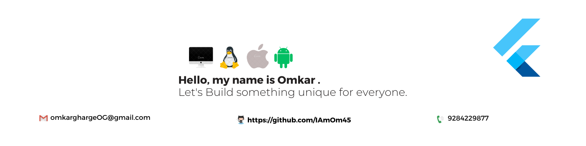

  

<h1 align="center">Hi 👋, I'm Omkar Gharge</h1>
<h3 align="center">Mobile Application Developer | Flutter & Android Enthusiast 🇮🇳</h3>

  

  

---

## 🚀 About Me

* 💼 Currently, I am a Mobile Application Developer contributing to **[Akbar Travels](https://play.google.com/store/apps/details?id=com.akbartravel.AkbarTravels&hl=en_IN&pli=1)**, focusing on high-performance mobile solutions using Flutter and native Android.
* 🌱 Focused on expanding my expertise into **Generative AI** and **Backend Development** to transition towards building robust, full-stack applications.
* 💻 All my public projects and open-source contributions are available here: **[My GitHub Profile](https://github.com/theomkargharge)**.
* 📧 Best way to reach me: **omkarghargeOG@Gmail.com**
* 📄 Explore my professional journey and experiences: **[Find My Resume Here!](YOUR_RESUME_LINK_HERE)**

---

## 🌐 Connect & Collaborate

    
    
    

---

## 🛠️ Tech Stack & Tools

### Primary Mobile Stack & Languages

  
  
  
  
  
  

### Web Fundamentals

  
  

### Backend, Databases & APIs

  
  
  
  

### State Management & Integrations

  
  
  
  
  
  
  

### Development Tools & Version Control

  
  
  
  
  
  
  

---

## 📊 GitHub Performance

  

    
  

---
### Thanks for stopping by! Let's connect and build something amazing together. 🚀
